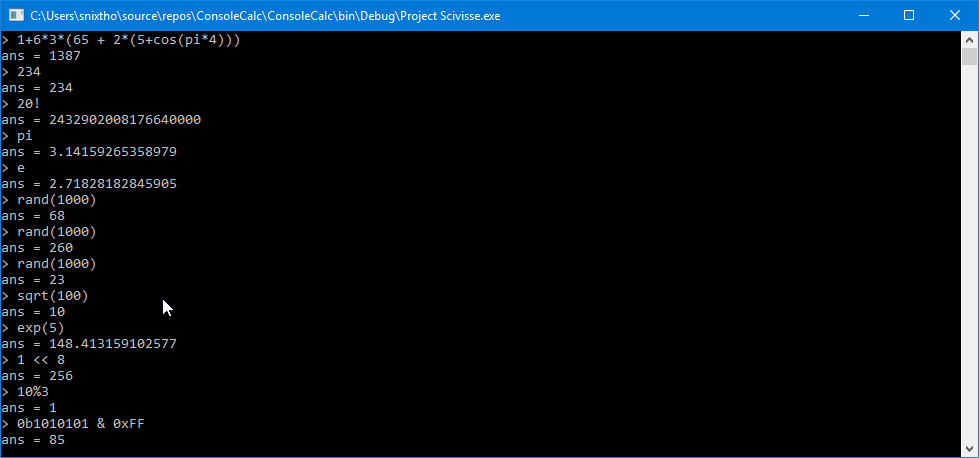

# Console-Calculator
This was mainly a fun practice/learning project. The calculator which is written in C# supports all basic math operators
with some extra things like factorial and binary operations. The TreeViewer project is a perfect-tree drawing program which i was originally thinking about hooking up to the parse tree which the calculator parser generates for debugging purposes. I may still do that in the future since the tree drawing is pretty much done already anyways, but we'll see.

## Screenshot

## Here is a full list of functions:

### Number representations

| Type   | Example   |
| float  | 23.53     |
| int    | 325       |
| binary | 0b1010110 |
| octal  | 0o7136254 |
| hex    | 0x3f7a21b |

### Operations

| Symbol | Description   |
| +  | Addition (a + b) |
| -  | Subtraction (a - b) |
| /  | Division (a / b) |
| *  | Multiplication (a * b) |
| %  | Modulo (a % b) |
| @  | XOR (a @ b) |
| |  | OR (a | b) |
| &  | AND (a & b) |
| ~  | Negation (~a) |
| |  | Factiorial (a!) |
| << | Shift Left (a << b) |
| >> | Shift Right (a >> b) |
| =  | Assignment for variables (a = b) - NOT IMPLEMENTED YET |

### Functions

| name | description |
abs(x)			Absolute Value of x
acos(x)			Inverse cosinus of x
asin(x)			Inverse sinus of x
atan(x)			Inverse tangent of x
atan2(x, y)		Inverse tangent of quotient x/y
ceil(x)			Round up of x
round(x)		Round nearest of x
floor(x)		Round down of x
cos(x)			Cosinus ofx
sin(x)			Sinus of x
tan(x)			Tangent of x
cosh(x)			Hyperbolic cosinus of x
sinh(x)			Hyperbolic sinus of x
tanh(x)			Hyperbolic tangent of x
ln(x)			Natural Logarithm of x
log10(x)		Base 10 logarithm of x
log(x)			Base 2 logarithm of x
logn(x, y)		Logarithm of x with base y
max(x, y)		Max number of x and y
min(x, y)		Min number of x and y
exp(x)			Exponential, e^x
sqrt(x)			Square root of x
sqrtn(x, y)		y root of x.
lcm(x, y)		Least common multiple of x and y
gcd(x, y)		Greatest common divisor of x and y
rand(x)			Random number from 0 to x
avg(x1,...,xN)  Average of the numbers given. 
